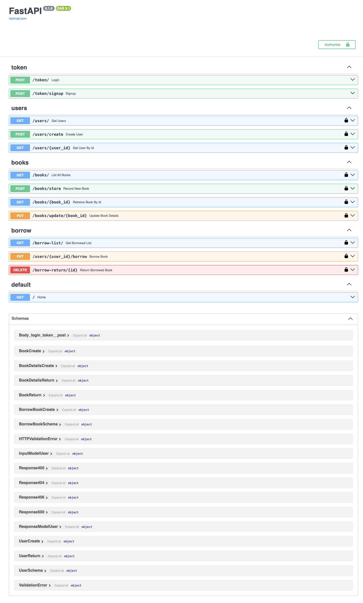

# Library Management System API

Building an REST API for Library Management System with FastAPI.
Two main entities are considered:
- Book
- User


## Project Setup Instruction

API development was done in MacOS but the Linux and Unix-like OS can follow following setup too.

```zsh
git clone https://github.com/rosxnb/library-management-system.git
cd library-management-system

python3.11 -m venv .venv
pip install -r requirements.txt
```


## Database Setup Instruction

**MySQL** was choosen as the database of interest.

Make sure to put your MySql database password in `data/db.py` file.


# Launch API App

```zsh
$ uvicorn main:server --reload
```


# API Documentations

- [Swagger](http://localhost:8000/docs)
- [Alternate Documentation](http://localhost:8000/redoc)


